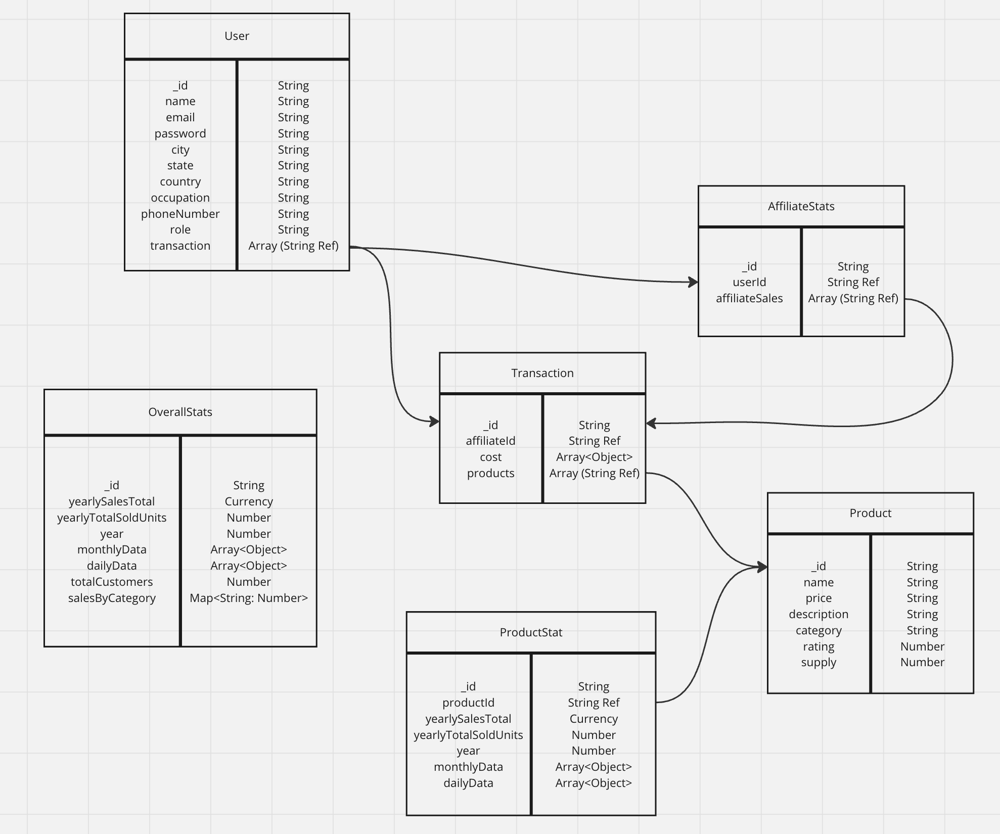

# Dashboard for Merchandising Analytics

## Overview

The dashboard is a web application designed for merchandising analytics. It provides a comprehensive and intuitive interface for managing and visualizing merchandising data. This dashboard is still in progress, containing mock filler data and missing features.

## Deployment

[Live Demo](https://modopo-admin-dashboard.netlify.app/)

Frontend is deployed with Netlify.
Backend is deployed with Render.

Please note the backend is hosted on Render's free tier and it takes time to spin up due to inactivity. Data population might take a few minutes to load.

## Features

Completed features:

- **Data Visualization**: Interactive charts and graphs to display merchandising data.
- **Analytics**: In-depth analysis tools to understand sales trends, inventory levels, and more.

In-progress features:

- **Account Management**: Account setup with different roles and permissions.
- **User Management**: Add, edit, and delete users with different roles and permissions.
- **Report Generation**: Generate reports for sales, inventory, and more.
- **Machine Learning Predictions**: Predict sales and inventory levels based on historical data.

## Technologies Used

- **Frontend**: React.js, Redux-Toolkit, Redux-Toolkit Query
- **Backend**: Node.js, Express.js
- **Database**: MongoDB
- **Styling**: Tailwind CSS

## Data Model

The data model used for the dashboard:


## Installation (Local)

1. **Clone the repository**:

   ```bash
   git clone https://github.com/modopo/admin-dashboard.git
   cd admin-dashboard
   ```

2. **Install dependencies for the server**:

   ```bash
   cd server
   npm install
   ```

3. **Install dependencies for the client**:
   ```bash
   cd ../client
   npm install
   ```

## Running the Application

1. **Start the server**:

   ```bash
   cd server
   npm start
   ```

2. **Start the client**:

   ```bash
   cd ../client
   npm start
   ```

3. **Open the application**:
   Navigate to `http://localhost:3000` in your web browser.

## License

This project is licensed under the MIT License. See the [LICENSE](LICENSE) file for details.

## Contact

For questions or support, please contact [modopo](https://github.com/modopo).

---

For more information, visit the [GitHub repository](https://github.com/modopo/admin-dashboard).
